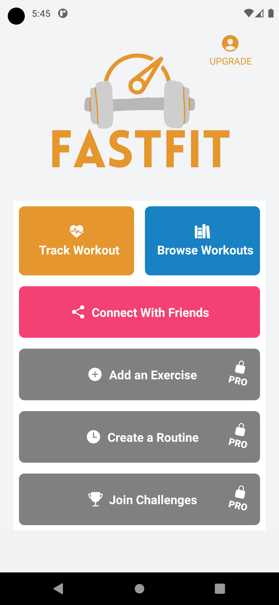

### In app subscriptions with Revenue Cat and EXPO in React Native

This is a sample app that shows how to use Revenue Cat with EXPO in React Native.

## Getting started
 - npm install
 - npx expo start
 - npm run start
 - npm run android
 - npm run ios

## How to use
    - Create an account in Revenue Cat
    - Create a new app
    - Copy the API key
    - Paste the API key in the file `src/config.js`
    - Create a new product in Revenue Cat
    - Copy the product ID
    - Paste the product ID in the file `src/config.js`
    - Run the app
    - Click on the button "Buy"
    - Click on the button "Restore Purchases"

## How to use with EXPO

